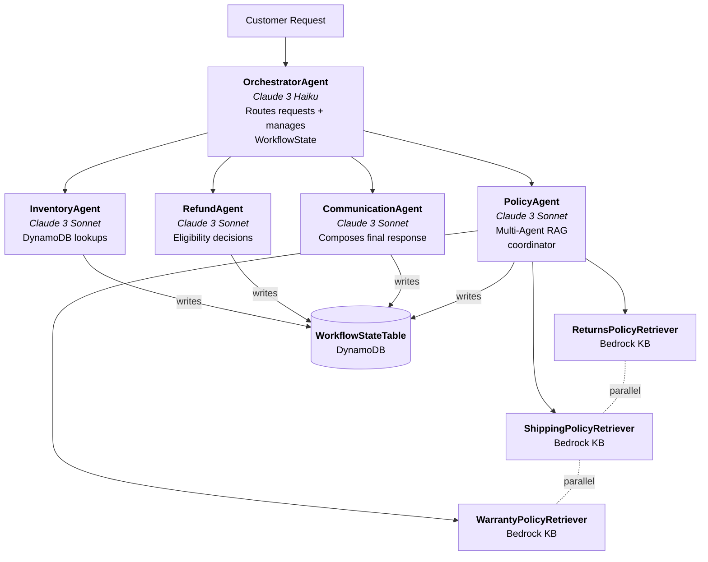
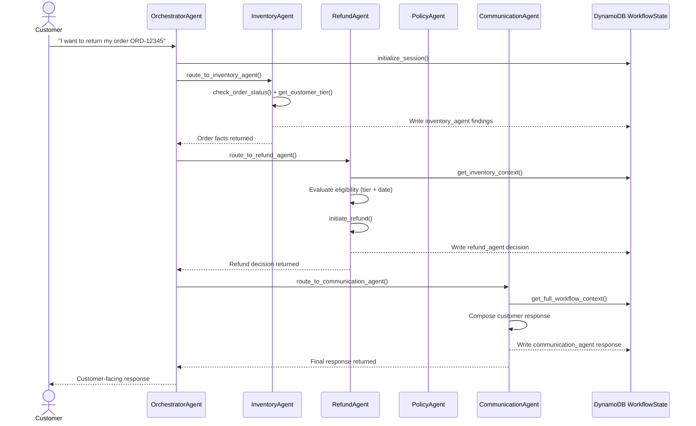
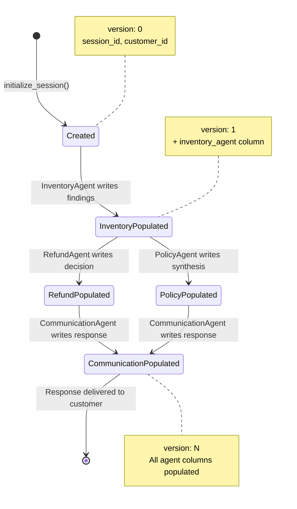

# 3 - Capstone Project - NovaMart - Multi Agent E-commerce RAG

## Project Overview

### Introduction

You are an Enterprise AI Solutions Architect at NovaMart, a fictional e-commerce company. The company's customer support team handles thousands of requests daily — order status inquiries, return and refund requests, policy questions, and more. Currently, support agents manually look up orders, cross-reference policies, and draft responses — a process that is slow, inconsistent, and error-prone.

Your job is to build the AI layer that automates this workflow.

### The Challenge

NovaMart needs a customer support system that can automatically understand a customer's request, gather relevant information from multiple data sources, make decisions based on company policies, and compose a professional response — all without human intervention. The system must handle multiple types of requests (order lookups, refund decisions, policy questions) by routing them to the right specialist, enforce enterprise safety guardrails, and provide full observability into every decision the AI makes.

### Your Product

You will build a production-grade multi-agent customer support system using Amazon Bedrock AgentCore and the Strands Agents SDK. The system consists of five AI agents working together in an Orchestrator → Workers hierarchy:

- An Orchestrator Agent that understands customer intent and routes requests to the right specialist
- An Inventory Agent that retrieves order and customer data from DynamoDB
- A Policy Agent that answers policy questions using parallel multi-agent RAG across three Knowledge Bases
- A Refund Agent that makes return eligibility decisions based on order data and policy rules
- A Communication Agent that composes the final customer-facing response

The system is deployed to AgentCore Runtime with Bedrock Guardrails for safety, session memory for multi-turn conversations, and CloudWatch/X-Ray observability for monitoring and debugging.

### Deliverables

To complete this project, you must submit:

- Completed `src/agent_orchestrator.py` — All TODO items implemented (Tasks 2, 3, 4, 6)
- Three Bedrock Knowledge Bases — Created in the AWS Console with synced data sources (Task 5)
- Populated `.env` file — With your Knowledge Base IDs, AgentCore Runtime ARN, and Guardrail configuration
- X-Ray Service Map screenshot — Showing the full trace of an end-to-end request through your multi-agent system (Task 6)

### Key Resources

- **Strands Agents SDK Documentation** — Official documentation for the Strands Agents SDK used throughout the project — covering the Agent class, `@tool` decorator, and BedrockModel configuration.
- **Amazon Bedrock Knowledge Bases — Getting Started** — Step-by-step AWS guide for creating Bedrock Knowledge Bases in the console — the exact steps required in Phase 3 of this project.
- **AgentCore CLI** — The deployment tool used by this project. The supplied helper stages code, configures the runtime, and runs `agentcore deploy`. AWS SDK calls are still used for application services, guardrails, memory, and observability services.

## Environment Setup

### Project Environment

Provided below is a Udacity workspace with Python and all required dependencies pre-installed. The workspace contains the starter project folder with everything you need to begin.

### Start Workspace

Workspaces will shut down after 30 minutes of inactivity. Any running processes will be stopped.

Workspaces may take up to 5 minutes to start.

### Deploy the Foundation Infrastructure

The project includes a CloudFormation stack that provisions the AWS resources your agents will use. You need to deploy this stack before starting any implementation work. You can find the files being referred to below in the workspace above or in the GitHub repo here.

The stack (`infrastructure/starter_stack.yaml`) creates:

- DynamoDB tables: `novamart-agentcore-orders`, `novamart-agentcore-customers`, `novamart-agentcore-workflow-state`
- S3 bucket: for policy documents. The AgentCore CLI stores its deployment package in the CDK bootstrap assets bucket, created on the first runtime deployment.
- S3 Vectors: a vector bucket with three vector indexes (`returns-policy-index`, `shipping-policy-index`, `warranty-policy-index`) — the backing store for the three Knowledge Bases
- IAM role: Execution role for the AgentCore Runtime with permissions for Bedrock, Knowledge Bases, DynamoDB, S3, S3 Vectors, CloudFormation, CloudWatch, and X-Ray
- CloudWatch: Log group for agent execution logs

#### Deploy the Stack

**Option A — AWS Console:**

1. Navigate to AWS Console → CloudFormation → Create stack → With new resources (standard)
2. Select Upload a template file → choose `infrastructure/starter_stack.yaml` → Next
3. Stack name: `novamart-agentcore` → Next
4. Leave stack options as defaults → Next
5. On the review page, check "I acknowledge that AWS CloudFormation might create IAM resources with custom names"
6. Click Submit
7. Wait for stack status to reach `CREATE_COMPLETE`

**Option B — AWS CloudShell:**

Open AWS Console → CloudShell (bottom-left icon), upload the template file, then run:

```bash
aws cloudformation deploy \
  --template-file starter_stack.yaml \
  --stack-name novamart-agentcore \
  --capabilities CAPABILITY_NAMED_IAM \
  --region us-east-1
```

CloudShell is a browser-based shell in the AWS Console with AWS CLI pre-installed — no local setup required.

Wait for the stack to finish deploying. If using CloudShell, you can check the status with:

```bash
aws cloudformation describe-stacks \
  --stack-name novamart-agentcore \
  --query "Stacks[0].StackStatus" \
  --region us-east-1
```

The stack is ready when the status shows `CREATE_COMPLETE`.

### Seed the Initial Data

After the stack is deployed, seed the DynamoDB tables and S3 bucket with sample data:

```bash
python infrastructure/seed_data.py
```

This populates:

- DynamoDB tables with mock customers (with Standard and Premium tiers) and orders
- S3 policy-docs bucket with sample return, shipping, and warranty policy documents

### Configure Environment Variables

```bash
cp .env.example .env
```

Most resource names are loaded automatically from CloudFormation exports — you don't need to fill them in manually. The `.env` file only holds values that are populated as you complete each task (Knowledge Base IDs, AgentCore Runtime ARN, Guardrail configuration).

### Verify Your Setup

```bash
python config.py
```

You should see a configuration table showing all resource names, including the S3 Vectors bucket and index names you will select in Phase 3. Fields showing `(not yet created)` are expected — they are populated as you complete each task.

### Local Machine Instructions

If you prefer to develop on your local machine instead of the workspace:

- Ensure you have Python 3.12+ and the AWS CLI configured with credentials for the `us-east-1` region
- Set up a virtual environment:
  ```bash
  python -m venv venv
  source venv/bin/activate    # On Windows: venv\Scripts\activate
  pip install -r requirements.txt
  ```
- Follow the same CloudFormation deployment and data seeding steps above

## System Architecture

### Overview

Your system should follow an Orchestrator → Workers pattern where a central Orchestrator Agent routes customer requests to specialist worker agents. Each worker should operate on a specific domain (inventory, policy, refunds, communication) and write its findings to a shared DynamoDB WorkflowState record.

### Agent Graph



### Request Flow

The sequence diagram below shows how a typical return request should flow through the system:



### Shared WorkflowState

The WorkflowState record in DynamoDB should use optimistic locking — each update should include an `expected_version` that must match the current version. This prevents concurrent agents from overwriting each other's results.



### Recommended Agent Roles

| Agent | Model | Responsibility | Tools |
|-------|-------|----------------|-------|
| OrchestratorAgent | Claude 4.5 Haiku | Routes requests, creates/updates WorkflowState | initialize_session, route_to_inventory_agent, route_to_policy_agent, route_to_refund_agent, route_to_communication_agent |
| InventoryAgent | Claude 4.5 Sonnet | Gathers order and customer facts from DynamoDB | check_order_status, get_customer_tier, list_customer_orders |
| PolicyAgent | Claude 4.5 Sonnet | Coordinates parallel RAG retrieval from 3 KBs, synthesizes results | search_all_policies (internally fans out to 3 retriever sub-agents) |
| RefundAgent | Claude 4.5 Sonnet | Makes return/refund eligibility decisions (30-day Standard, 60-day Premium) | get_inventory_context, initiate_refund |
| CommunicationAgent | Claude 4.5 Sonnet | Drafts final, empathetic customer-facing response | get_full_workflow_context |

## Phase 1 - Build the Multi-Agent Graph

**File:** `src/agent_orchestrator.py`

In this phase, you will implement five Strands Agents that form an Orchestrator → Workers hierarchy. This is the core of the project — by the end of this phase, you will have a working multi-agent system that can route customer requests, retrieve data, make decisions, and compose responses.

### Your Files

| File | Role | Action |
|------|------|--------|
| `src/agent_orchestrator.py` | Main implementation file — agent builders, routing tools, deployment | Implement TODOs |
| `src/agent_utils.py` | Terminal trace UI, ANSI colours, AgentTrace class | Do not modify |
| `src/agent_observability.py` | X-Ray tracing (`@tool` wrapper) and CloudWatch logging | Do not modify |
| `src/bedrock_kb_retrieval.py` | KB retrieval helper used by PolicyAgent | Do not modify |
| `src/demo.py` | Runs one end-to-end request for local testing | Do not modify |
| `config.py` | Central configuration — reads CloudFormation exports + `.env` | Do not modify |
| `tests/test_agent.py` | Automated test suite | Do not modify |
| `src/agentcore_cli.py` | AgentCore CLI wrapper: stage code, configure, deploy, read runtime ARN | Do not modify |

**What is `agent_utils.py`?** It contains the terminal trace UI that makes agent activity visible during chat and demo runs — colour-coded step banners, tool call formatting, parallel retrieval display, and the DynamoDB workflow summary. You do not need to read or understand it to complete the project.

**What is `agent_observability.py`?** It provides the `@tool` decorator used in `agent_orchestrator.py` — the Strands `@tool` plus an X-Ray subsegment per call — so every request you run is traced to AWS X-Ray automatically (Phase 4). Use `@tool` exactly as you would with Strands.

### Background: Strands Agents

The Strands Agents SDK lets you build AI agents by decorating Python functions with `@tool` and passing them to an Agent along with a model and system prompt. When called like a function, the agent reasons through the problem and invokes its tools as needed. Refer to the SDK documentation for usage details.

### Background: WorkflowState

`WorkflowStateTable` is a shared DynamoDB record (keyed by `session_id`) that accumulates each worker's output as the request flows through the pipeline. Three pre-written helpers manage it — use them inside your routing tools:

- `_create_workflow_state(session_id, customer_id)` — creates a blank record
- `_read_workflow_state(session_id)` — reads the current state
- `_update_workflow_state(session_id, updates, expected_version)` — writes with optimistic locking

### 1.A — InventoryAgent

Build a worker agent that gathers order and customer facts from DynamoDB. It should **NOT** make decisions — only report what it finds.

Implement three tools that look up data from the DynamoDB tables provisioned by the CloudFormation stack you deployed earlier. Use `config.ORDERS_TABLE` and `config.CUSTOMERS_TABLE` for the table names. Note that the Orders table has a composite key (`customer_id` + `order_id`), which is why the `check_order_status` stub takes both. Write a system prompt that instructs the agent to be a data gatherer — it should retrieve information accurately and never make eligibility decisions.

**Model:** `config.WORKER_MODEL_ID` (Claude Sonnet 4.5), **Temperature:** 0.1

### 1.B — RefundAgent

Build a worker agent that makes return/refund eligibility decisions. It reads facts from WorkflowState (populated by InventoryAgent) and applies the correct policy window based on customer tier.

**Policy windows:** Standard customers = 30 days, Premium customers = 60 days.

Implement two tools: one that reads the inventory findings from WorkflowState, and one that processes the return by updating the order record in DynamoDB. Write a system prompt that instructs the agent on the decision process — it should always check inventory context first, then apply the correct return window.

**Model:** `config.WORKER_MODEL_ID`, **Temperature:** 0.1

### 1.C — PolicyAgent — Multi-Agent RAG

Build a coordinator agent that answers policy questions by running three specialized retriever sub-agents in parallel. This is the core architectural pattern of this project.

Inside `build_policy_agent()`, create three retriever sub-agents — one for each policy domain (Returns, Shipping, Warranty). Each retriever should have a single tool that calls `retrieve_from_knowledge_base()` (imported from `bedrock_kb_retrieval.py`) with the appropriate Knowledge Base ID from config.

Then implement the `search_all_policies` tool that invokes all three retrievers simultaneously using `ThreadPoolExecutor` and collects their results. The trace calls in the starter code show you where the parallel execution should happen.

Finally, create the PolicyAgent coordinator with a system prompt that instructs it to always call `search_all_policies` first, then synthesize the retrieved passages into a grounded answer.

- Retrievers: `config.WORKER_MODEL_ID`, **Temperature:** 0.0 (deterministic retrieval)
- PolicyAgent coordinator: `config.WORKER_MODEL_ID`, **Temperature:** 0.2

### 1.D — CommunicationAgent

Build a worker agent that drafts the final customer-facing response. It reads the full WorkflowState (all findings from previous agents) and composes a professional, empathetic message.

Implement one tool that reads the complete WorkflowState record. Write a system prompt that instructs the agent to include all relevant information from previous agents and maintain a warm, professional tone.

**Model:** `config.WORKER_MODEL_ID`, **Temperature:** 0.3 (for warm, natural tone)

### 1.E — OrchestratorAgent

Build the orchestrator that routes requests and manages WorkflowState. This agent does not answer questions directly — it delegates everything to the appropriate specialist.

Implement five routing tools: `initialize_session`, `route_to_inventory_agent`, `route_to_policy_agent`, `route_to_refund_agent`, and `route_to_communication_agent`. Each routing tool should read the current WorkflowState, invoke the appropriate worker agent, and then update the WorkflowState with the result.

Write a system prompt that enforces these routing rules:

| Rule | Trigger | Action |
|------|---------|--------|
| 1 | Every request, always | Call `initialize_session` first |
| 2 | Order status / return / refund requests | Route to inventory agent first, then refund agent |
| 3 | Policy meaning questions (return windows, shipping rates, warranty terms) | Route to policy agent |
| 4 | Account questions ("what is my tier?", "am I premium?") | Route to inventory agent — never policy agent (it only knows policy text, not customer data) |
| 5 | Math / calculation questions | Orchestrator → CommunicationAgent, skip Inventory, Policy and Refund. |
| 6 | Every request, always (last step) | Route to communication agent to compose the final reply |

**CRITICAL:** The Orchestrator must never write the final customer-facing response itself. It must always delegate to the communication agent as its very last tool call — no exceptions.

**Model:** `config.ORCHESTRATOR_MODEL_ID` (Claude Haiku 4.5 — fast, cost-efficient)
**Temperature:** 0.0 (deterministic routing)

### Test Your Work

```bash
python tests/test_agent.py task2
```

For a live end-to-end test, three modes are available:

- **Single pre-scripted request** — runs one full refund scenario:
  ```bash
  python src/demo.py
  ```
- **Runs 3 hardcoded scenarios** and prints raw responses:
  ```bash
  python src/agent_orchestrator.py test
  ```
- **Interactive terminal chat** — type queries and watch the live trace:
  ```bash
  python src/agent_orchestrator.py chat
  ```

### Tips

- The orchestrator should have `temperature=0.0` — deterministic routing is critical
- Each `@tool` function's docstring is what the agent reads to decide when to use it — write clear docstrings
- For the PolicyAgent retrievers: you are creating agents **INSIDE** `build_policy_agent()`. Each retriever is a full Strands Agent instance
- Don't forget to return `Agent(...)` at the end of each build function

## Phase 2 - Deployment

**File:** `src/agent_orchestrator.py`

In this phase, implement the functions that create the guardrail, deploy the runtime and configure Memory. Do not run the full deployment yet. First complete these functions, then continue to Phase 3 to create the Knowledge Bases and Phase 4 to implement observability. You will deploy and test the complete system in Phase 4.

### Task 3 — Guardrail and Runtime Deployment

#### Background

Bedrock Guardrails filter model inputs and outputs. AgentCore Runtime hosts your agent application. This project deploys the runtime using the AgentCore CLI, through the supplied `src/agentcore_cli.py` helper.

#### Implement `create_guardrail()`

Create a Bedrock Guardrail using the bedrock client with these policies:

- **Content policy:** SEXUAL, VIOLENCE and HATE at HIGH strength; INSULTS and MISCONDUCT at MEDIUM strength.
- **PII policy:** BLOCK credit card numbers and SSNs; ANONYMIZE emails and phone numbers.
- **Topic policy:** DENY competitor products, pricing negotiations and legal threats.
- **Word policy:** Enable the managed profanity list.
- Include friendly blocked messages for both inputs and outputs.

For the topic policy, use `topicPolicyConfig.tierConfig = {"tierName": "STANDARD"}` and top-level `crossRegionConfig = {"guardrailProfileIdentifier": "us.guardrail.v1:0"}`. Define pricing negotiations as haggling or requests to change an advertised price, while allowing calculations using a specified price and discount. This avoids the false positive observed with the project's math scenario on the Classic tier.

Publish a numbered version with `create_guardrail_version()` and return `(guardrail_id, guardrail_version)`. Use that numbered version, not `DRAFT`. During final testing, verify that the math question and its answer are allowed and that negotiation, competitor and legal-threat examples are blocked.

#### Implement `deploy_to_agentcore_runtime()`

The supplied code stages your application and helper modules in `build/runtime/`. Complete the TODO to:

1. Build the runtime environment variables: `AWS_REGION`, `PROJECT_NAME`, `RETURNS_KB_ID`, `SHIPPING_KB_ID`, `WARRANTY_KB_ID`, `AGENT_LOG_GROUP`, `GUARDRAIL_ID` and `GUARDRAIL_VERSION`.
2. Pass them to `agentcore_cli.configure_runtime()` with `network_mode='PUBLIC'`, `protocol='HTTP'` and `execution_role_arn=config.AGENTCORE_ROLE_ARN`.
3. Call `agentcore_cli.deploy()`. The CLI packages the application and deploys it through CloudFormation.
4. Read the ARN with `agentcore_cli.deployed_runtime_arn()` and return it.

Do not implement a direct `create_agent_runtime()` SDK call. The supplied `_apply_guardrail()` applies the guardrail to each agent's model using the ID and version provided in the runtime environment variables.

### Task 4 — Memory

#### Background

AgentCore Memory provides storage for conversation context. This task configures a Memory resource with a session-summary strategy and seven-day event retention.

#### Implement `configure_memory(runtime_arn)`

Create the resource with `agentcore_control.create_memory()`, using the `summaryMemoryStrategy` and `eventExpiryDuration=7`. The supplied code waits for the resource to become `ACTIVE`; return its ARN.

### Next Step

Continue to Phase 3 — Knowledge Bases, then implement observability in Phase 4. The full deployment calls both the Memory and Observability functions and requires all three Knowledge Base IDs. Phase 4 contains the deployment and test commands.

## Phase 3 - Knowledge Bases

**Location:** AWS Console (no code changes required)

In this phase, you will create three Bedrock Knowledge Bases — one per policy domain. These are the data sources that power the parallel multi-agent RAG system you built in Phase 1.

### Background: Bedrock Knowledge Bases with S3 Vectors

A Knowledge Base is a managed RAG service — point it at an S3 prefix and Bedrock handles chunking, embedding (Titan Embed Text v2), and vector indexing into S3 Vectors (serverless, no OpenSearch needed). S3 Vectors is a separate service from general-purpose S3: a Knowledge Base needs a vector bucket and one vector index per KB. Your CloudFormation stack created both — run `python config.py` to see their names. The `bedrock-agent-runtime.retrieve()` API returns the top-k relevant passages.

### Step 1: Verify Policy Documents

The policy documents were uploaded to S3 when you ran `seed_data.py` during environment setup. They are organized under three prefixes:

- `s3://{policy-docs-bucket}/policies/returns/` ← returns policy documents
- `s3://{policy-docs-bucket}/policies/shipping/` ← shipping policy documents
- `s3://{policy-docs-bucket}/policies/warranty/` ← warranty policy documents

You can verify in the AWS Console:

1. Navigate to AWS Console → S3
2. Open the bucket named `novamart-agentcore-policy-docs-{ACCOUNT_ID}-{suffix}` (the exact name is the Policy Bucket line of `python config.py`)
3. Navigate to the `policies/` prefix
4. Verify you see three folders: `returns/`, `shipping/`, `warranty/`, each containing policy documents

Alternatively, in AWS CloudShell (browser-based shell with AWS CLI pre-installed):

```bash
aws s3 ls s3://$(python -c "import config; print(config.POLICY_BUCKET)")/policies/ --recursive
```

### Step 2: Create Three Knowledge Bases in the AWS Console

Navigate to: AWS Console → Amazon Bedrock → Knowledge Bases → Create Knowledge Base

Create three KBs with these settings (one per domain):

| Setting | Returns KB | Shipping KB | Warranty KB |
|---------|------------|-------------|-------------|
| Name | novamart-returns-policy-kb | novamart-shipping-policy-kb | novamart-warranty-policy-kb |
| S3 data source prefix | `policies/returns/` | `policies/shipping/` | `policies/warranty/` |
| Embedding model | Amazon Titan Embed Text v2 | Amazon Titan Embed Text v2 | Amazon Titan Embed Text v2 |
| Vector store | S3 Vectors → Use an existing vector bucket | same | same |
| S3 Vectors bucket | Vector Bucket from `python config.py` (`novamart-agentcore-vectors-…`) | same | same |
| Vector index | `returns-policy-index` | `shipping-policy-index` | `warranty-policy-index` |

**Do not choose Managed KB** — that creates a different vector bucket than the one the project (and the rubric) expects, and the backing store cannot be changed afterwards. Use Self-managed KBs.

After creating each KB, click **Sync** to index the documents.

### Step 3: Add KB IDs to your `.env`

Copy each Knowledge Base ID from the console and add to your `.env`:

```env
RETURNS_KB_ID=<your-returns-kb-id>
SHIPPING_KB_ID=<your-shipping-kb-id>
WARRANTY_KB_ID=<your-warranty-kb-id>
```

### Test Your Work

```bash
python tests/test_agent.py task5
```

### Tips

- After creating a KB, you **MUST** click "Sync" before queries will return results
- If retrieval returns empty results, check that your KB IDs in `.env` match the console
- The S3 Vectors bucket and the three indexes were already created by the CloudFormation stack you deployed earlier; `python tests/test_agent.py task5` reports which vector store each KB uses

## Phase 4 - Observability & Testing

**File:** `src/agent_orchestrator.py`

In this final phase, you will enable observability for your deployed agent system and run the end-to-end submission tests.

### Task 6 — Observability

#### Background: AgentCore Observability

AgentCore Observability routes execution data to CloudWatch Logs (reasoning chains, tool calls, responses) and AWS X-Ray (distributed latency traces across the full Orchestrator → Worker call chain).

#### What to Implement

`configure_observability(runtime_arn)`

Configure logging and tracing for the AgentCore runtime by building a `loggingConfiguration` dict and passing it to the pre-written `apply_observability_config()`:

- **CloudWatch Logs (`cloudWatchConfig`):** Point to `config.AGENT_LOG_GROUP`, set `INFO`-level logging, enable it
- **X-Ray (`xRayConfig`):** Enable tracing with 100% sampling rate

`apply_observability_config()` turns that into real AWS state: it enables CloudWatch Transaction Search (the mechanism AgentCore Observability uses) at the sampling percentage you chose, creates the log group, and stores the settings as environment variables on your runtime so the deployed agent logs and traces exactly as configured.

**How traces reach X-Ray:** The pre-written `agent_observability.py` records every request as one X-Ray trace: each `route_to_*` tool becomes a worker-agent node and each Knowledge Base retrieval a `KnowledgeBase:*` node. It works the same from your machine (`test`, `chat`, `demo`) and inside the deployed runtime (`invoke`), so the Service Map below shows the real call chain of your code.

#### Test Your Work

```bash
python tests/test_agent.py task6
```

After the automated tests pass, send a test request through the system:

```bash
python src/agent_orchestrator.py test
```

Each scenario prints its X-Ray trace id. Then navigate to AWS Console → CloudWatch → X-Ray traces → Service map (also reachable as X-Ray → Service map) and select **Last 5 minutes**. You should see a trace graph showing the full call chain from NovaMart-Orchestrator through to the worker agents and Knowledge Bases.

#### Tips

- X-Ray traces may take 30–60 seconds to appear in the console after invocation
- Set `samplingRate=1.0` during development so every request is traced

### End-to-End Submission Test

With all tasks complete, run the full deployment:

```bash
python src/agent_orchestrator.py deploy
```

Test these scenarios manually to verify your system handles all three request types:

| Scenario | Expected Routing |
|----------|------------------|
| "I want to return my order ORD-27176" (as CUST-001) | Orchestrator → Inventory → Refund → Communication |
| "What is the return policy for premium customers?" | Orchestrator → Policy (3 parallel KB retrievers) → Communication |
| "How much are 5 items at $29.99 with 10% off?" | Orchestrator → CommunicationAgent; skip Inventory, Policy and Refund. |

Run the full test suite one final time:

```bash
python tests/test_agent.py all
```

#### Required Deliverables

- Take a screenshot that shows that all tests passed, and shows that you have 120 scores.
- Take a screenshot of your X-Ray Service Map after running a live request. Navigate to AWS Console → CloudWatch → X-Ray traces → Service map and capture the full trace graph showing the Orchestrator → Worker call chain.

### Clean Up

After you have taken your screenshots and submitted the project, delete everything it created so the AWS account stops incurring charges:

```bash
python infrastructure/cleanup.py          # dry run - lists what would be deleted
python infrastructure/cleanup.py --yes    # deletes it
```

Clean up after submitting. Nothing in the reviewed submission depends on the resources still existing, but you may need them again if the reviewer asks for changes.

## Rubric

Use this project rubric to understand and assess the project criteria.

### Multi-Agent Graph

#### Criteria: Implement worker agents with correct tools, models, and configurations

**Submission Requirements:**

- `build_inventory_agent()` returns a Strands Agent with `check_order_status`, `get_customer_tier`, and `list_customer_orders` tools
- `build_refund_agent()` returns a Strands Agent with `get_inventory_context` and `initiate_refund` tools; Standard return window = 30 days, Premium = 60 days
- `build_communication_agent()` returns a Strands Agent with `get_full_workflow_context` tool
- All worker agents use `config.WORKER_MODEL_ID` (Claude Sonnet 4.5)
- InventoryAgent and RefundAgent use `temperature=0.1`; CommunicationAgent uses `temperature=0.3`
- Each tool function includes a clear docstring describing its purpose, parameters, and return value

#### Criteria: Implement multi-agent RAG with parallel retrieval using ThreadPoolExecutor

**Submission Requirements:**

- `build_policy_agent()` creates three retriever sub-agents: `ReturnsPolicyRetrieverAgent`, `ShippingPolicyRetrieverAgent`, and `WarrantyPolicyRetrieverAgent`
- Each retriever has one tool that calls `retrieve_from_knowledge_base()` with the correct KB ID (`config.RETURNS_KB_ID`, `config.SHIPPING_KB_ID`, `config.WARRANTY_KB_ID`)
- `search_all_policies` tool invokes all three retrievers in parallel using `ThreadPoolExecutor(max_workers=3)` and `as_completed()`
- Retriever agents use `temperature=0.0`; the coordinator PolicyAgent uses `temperature=0.2`
- Results from all three retrievers are collected and returned

#### Criteria: Implement the OrchestratorAgent with routing rules and shared WorkflowState management

**Submission Requirements:**

- `build_orchestrator_agent()` returns a Strands Agent using `config.ORCHESTRATOR_MODEL_ID` (Claude Haiku 4.5) with `temperature=0.0`
- System prompt enforces all six routing rules specified in the project instructions
- `initialize_session` tool creates a WorkflowState record at session start
- Each routing tool reads WorkflowState before calling the worker and updates it afterward using `_update_workflow_state()` with the correct `expected_version`
- `route_to_communication_agent` is always the final tool call for every request
- The Orchestrator never writes the customer response itself
- `python tests/test_agent.py task2` passes

### AgentCore Runtime and Guardrails

#### Criteria: Create a Bedrock Guardrail with enterprise safety policies

**Submission Requirements:**

- `create_guardrail()` creates a Bedrock Guardrail with content policy (SEXUAL, VIOLENCE, HATE at HIGH strength; INSULTS, MISCONDUCT at MEDIUM strength)
- PII policy: BLOCK for credit card numbers and SSNs; ANONYMIZE for emails and phone numbers
- Topic policy: DENY for competitor products, pricing negotiations, and legal threats
- Word policy: managed profanity list enabled
- `create_guardrail_version()` is called after creation to produce a versioned (non-DRAFT) guardrail
- Returns `(guardrail_id, guardrail_version)`

#### Criteria: Deploy the multi-agent system to AgentCore Runtime with guardrail attached

**Submission Requirements:**

- `deploy_to_agentcore_runtime()` deploys through AgentCore CLI using `agentcore_cli.configure_runtime()`, `agentcore_cli.deploy()` and `agentcore_cli.deployed_runtime_arn()`
- The runtime uses PUBLIC networking, HTTP and the foundation stack's execution role
- Runtime environment variables include `AWS_REGION`, `PROJECT_NAME`, `RETURNS_KB_ID`, `SHIPPING_KB_ID`, `WARRANTY_KB_ID`, `AGENT_LOG_GROUP`, `GUARDRAIL_ID` and a numbered `GUARDRAIL_VERSION`
- The supplied `_apply_guardrail()` applies the configured guardrail to each agent's model
- `.env` contains the deployed `AGENTCORE_RUNTIME_ARN`
- `python tests/test_agent.py task3` passes after all deployment prerequisites are complete

### Memory and Knowledge Bases

#### Criteria: Configure AgentCore Memory for session-scoped conversational context

**Submission Requirements:**

- `configure_memory()` calls `agentcore_control.create_memory()` with a `SESSION_SUMMARY` memory strategy (`summaryMemoryStrategy`)
- `eventExpiryDuration=7` (7-day retention)
- Includes a descriptive name and description for the memory resource
- Returns the `memoryArn`
- `python tests/test_agent.py task4` passes

#### Criteria: Create and configure three Bedrock Knowledge Bases for multi-agent RAG

**Submission Requirements:**

- Three Knowledge Bases created in the AWS Console: Returns (`policies/returns/`), Shipping (`policies/shipping/`), Warranty (`policies/warranty/`)
- Each KB uses the `amazon.titan-embed-text-v2:0` embedding model
- Each KB uses the S3 Vectors backing store created by the stack (`VectorStoreBucket`) with its matching vector index (`returns-policy-index`, `shipping-policy-index`, `warranty-policy-index`)
- Each KB's data source has been synced
- `.env` contains valid, non-empty values for `RETURNS_KB_ID`, `SHIPPING_KB_ID`, and `WARRANTY_KB_ID`

#### Criteria: Verify parallel retrieval returns results from all three Knowledge Bases

**Submission Requirements:**

- `python tests/test_agent.py task5` passes, including `test_5_parallel_retrieval`
- A query to `search_all_policies()` returns non-empty results from all three KBs (Returns, Shipping, Warranty)
- `python tests/test_agent.py task5` passes

### Observability

#### Criteria: Configure CloudWatch logging and X-Ray tracing for the deployed agent

**Submission Requirements:**

- `configure_observability()` builds a `loggingConfiguration` and passes it to the pre-written `apply_observability_config()` inside try/except
- CloudWatch config points to `config.AGENT_LOG_GROUP` with `logLevel='INFO'` and `enabled=True`
- X-Ray config with `enabled=True` and `samplingRate=1.0`
- `python tests/test_agent.py task6` passes

#### Criteria: Demonstrate end-to-end distributed tracing via X-Ray Service Map

**Submission Requirements:**

- A screenshot of the AWS X-Ray Service Map is submitted showing a connected trace graph after running `python src/agent_orchestrator.py test`
- The service map shows NovaMart-Orchestrator connected to the worker agent nodes, including the PolicyAgent and KnowledgeBase agents

### Industry Best Practices

#### Criteria: Write clean, modular, and well-documented agent code

**Submission Requirements:**

- Tool functions have docstrings that accurately describe their purpose, parameters, and return values
- Agent builder functions (`build_*_agent()`) are self-contained and each returns exactly one Agent instance
- Variable and function names are descriptive and follow Python naming conventions (`snake_case`)

#### Criteria: Apply correct model selection for each agent role

**Submission Requirements:**

- OrchestratorAgent uses `config.ORCHESTRATOR_MODEL_ID` (Claude Haiku 4.5) for fast, cost-efficient routing
- All worker agents use `config.WORKER_MODEL_ID` (Claude Sonnet 4.5) for higher-quality reasoning
- Model selections are not hardcoded - config constants are used throughout

- Run adversarial inputs against the Guardrail (prompt injection attempts, competitor mentions, legal threats) and document how each is handled with screenshots of blocked responses - demonstrating real-world safety validation.
- Add persistent conversation memory by creating a DynamoDB `agent-sessions` table and integrating the Strands SDK `DynamoDbSessionStorage` into the Orchestrator - enabling the agent to recall earlier messages in the same chat session without relying solely on AgentCore Memory, and demonstrating how local session storage complements cloud-based memory strategies.
- Build a CloudWatch dashboard showing agent invocation count over time, average response latency per agent type, and Guardrail trigger frequency - demonstrating production-grade observability thinking.
- Integrate AWS Cognito for customer authentication and build a frontend interface (e.g., using React or a simple HTML/JS page) that connects to the AgentCore Runtime endpoint - transforming the terminal-only system into a fully deployable, user-facing customer support application.